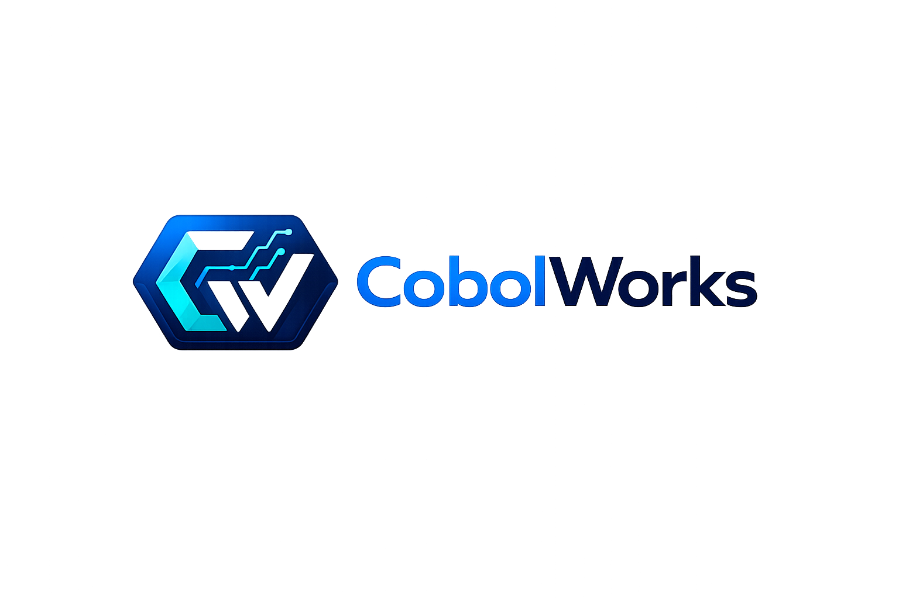
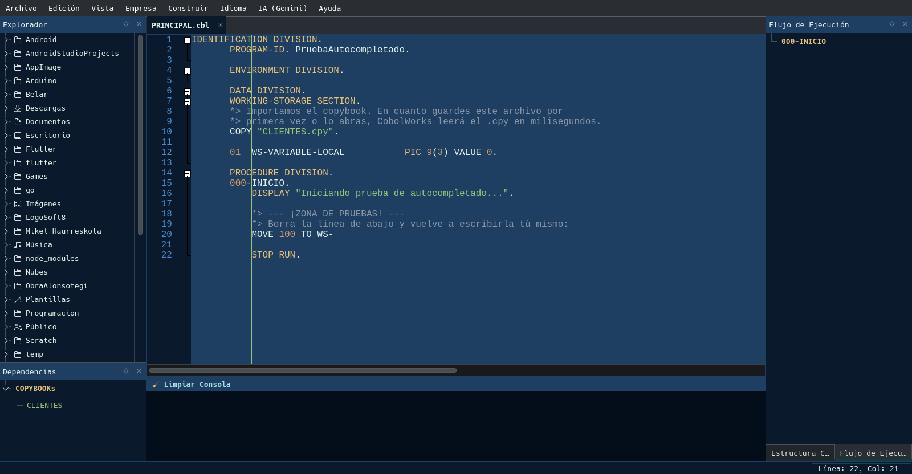

<p align="center">
  
</p>

<h1 align="center">🚀 CobolWorks IDE</h1>

<p align="center">
  <em>El entorno de desarrollo moderno para el programador de COBOL de siempre.</em>
</p>

<p align="center">
  <a href="https://anabasasoft.github.io"></a>
  <a href="mailto:anabasasoft@gmail.com"></a>
  
  
</p>

---

<p align="center">
  
</p>

---

CobolWorks no es solo un editor; es una **estación de trabajo completa** diseñada para revitalizar el mantenimiento y la migración de sistemas legacy. Desarrollado en **C++ y Qt6** para ofrecer el máximo rendimiento en entornos profesionales.

---

## ✨ Características Principales

| Función | Descripción |
|---|---|
| 🔍 **Análisis de Flujo Interactivo** | Visualiza el árbol de ejecución de `PERFORM` y `GO TO` en tiempo real |
| 🤖 **Migración con IA (Gemini)** | Traducción automática de rutinas COBOL a Python y Java mediante API REST nativa |
| 🐞 **Depurador Visual** | Interfaz gráfica para GDB/LLDB con breakpoints mediante clics en el margen |
| 📂 **Navegación de Copybooks** | Salto inteligente a definiciones y apertura automática de archivos `COPY` con **F2** |
| 🖥️ **Windows y Linux** | Funciona de forma nativa en ambas plataformas sin configuración adicional |

---

## 💰 ¿Quieres ahorrar tiempo? Compra el Binario Oficial

Este proyecto es **100% Código Abierto**. Puedes clonar el repositorio y compilarlo por tu cuenta siguiendo las instrucciones de abajo.

Sin embargo, si prefieres **evitar la configuración de compiladores** y quieres un instalador listo para usar — y de paso apoyar el desarrollo — puedes adquirir el binario oficial compilado y firmado para **Windows y Linux**:

👉 **[Descargar CobolWorks Pro (Ejecutable listo para usar)](https://gum.new/gum/cmnfzibk2000o04l232dybufq)**

---

## 🛠️ Cómo Compilar

### Requisitos previos

**Linux (Arch / Manjaro):**

```bash
sudo pacman -S qt6-base qscintilla-qt6 cmake gnu-cobol gdb
```

**Linux (Ubuntu / Debian):**

```bash
sudo apt install qt6-base-dev cmake gnucobol gdb
```

**Windows:** Instala [Qt6](https://www.qt.io/download), [CMake](https://cmake.org/download/) y [GnuCOBOL](https://gnucobol.sourceforge.io/) usando sus instaladores oficiales.

### Compilación

```bash
git clone https://github.com/anabasasoft/cobolworks.git
cd cobolworks
cmake -B build -DCMAKE_BUILD_TYPE=Release
cmake --build build --parallel
```

### Instalación

```bash
sudo cmake --install build
```

---

## 📬 Contacto y Soporte

¿Tienes dudas, encontraste un bug o quieres contribuir?

- 🌐 **Web:** [anabasasoft.github.io](https://anabasasoft.github.io)
- 📧 **Email:** [anabasasoft@gmail.com](mailto:anabasasoft@gmail.com)
- 🐛 **Issues:** Usa la pestaña [Issues](../../issues) de este repositorio

---

<p align="center">
  Hecho con ❤️ por <a href="https://anabasasoft.github.io">AnabasaSoft</a>
</p>
